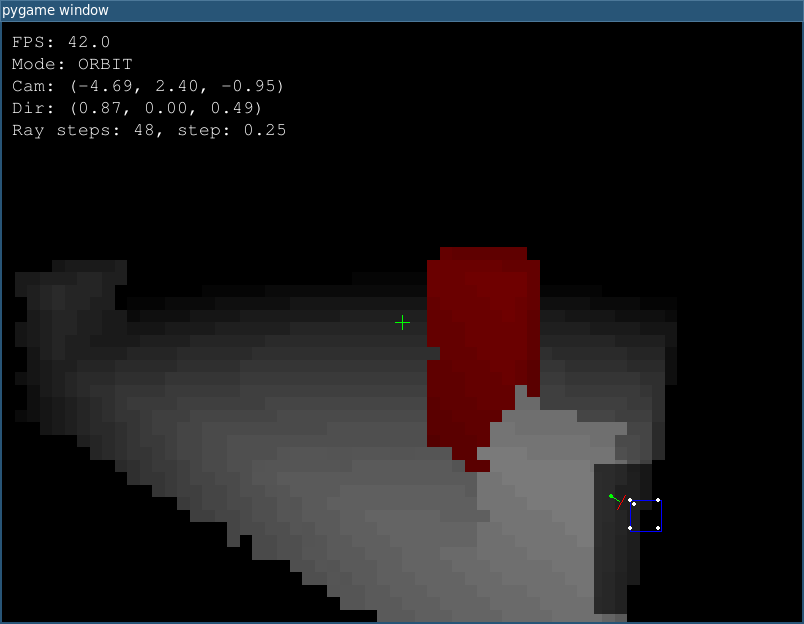

# pyvoxels

Voxel raymarching experiment in Python (Pygame + PyGLM).

## Run

```bash
uv sync
uv run main
```

If you already have a different virtualenv active, either deactivate it or use:

```bash
uv run --active main
```

## Screenshot



## Archive Notes

- First commit: `45b4f7e88a55f127457b473650b5698da750682b`
- First commit date: `2024-06-01 19:24:52 +0900`
- First commit message: `Initial commit`
